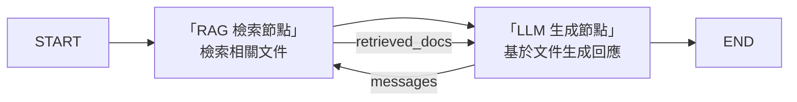
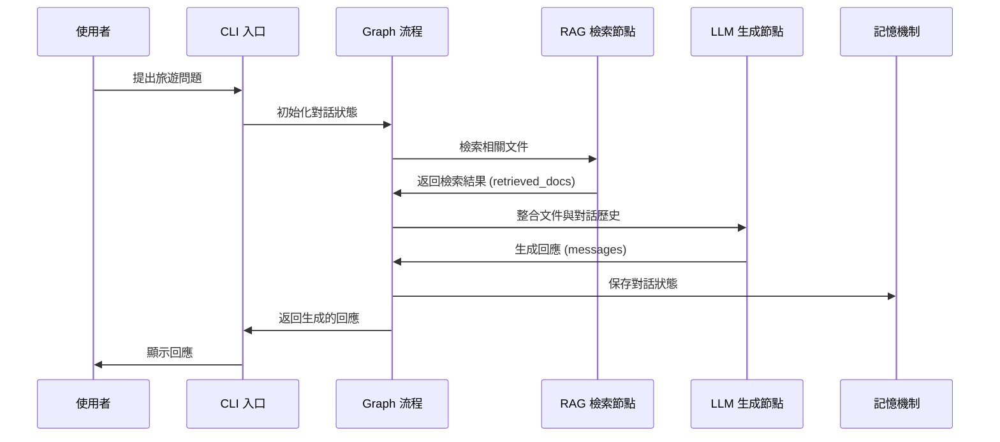

# 旅遊規劃 AI Agent — 架構總覽（第一版設計重點整合）

---

## 架構圖（Mermaid）


---

## 模組循序圖（Mermaid）



---

### 說明

1. **使用者與 CLI 互動**  
   - 使用者輸入旅遊問題，CLI 負責接收並傳遞給 Graph。

2. **Graph 流程管理**  
   - Graph 負責調用 RAG 節點檢索文件，並將檢索結果傳遞給 LLM 節點。

3. **RAG 檢索節點**  
   - 從向量資料庫中檢索與使用者 query 相關的文件，返回檢索結果。

4. **LLM 生成節點**  
   - 整合檢索到的文件與對話歷史，生成基於上下文的回應。

5. **記憶機制**  
   - 使用 MemorySaver 保存對話狀態，確保多輪對話的上下文記憶。

6. **回應返回**  
   - Graph 將生成的回應返回給 CLI，CLI 負責顯示給使用者。

---

### 模組功能對應

- **CLI**：負責與使用者互動，接收輸入並顯示回應。
- **Graph**：負責管理對話流程，調用 RAG 和 LLM 節點。
- **RAG 檢索節點**：檢索相關文件，提升回應的準確性。
- **LLM 生成節點**：生成基於文件與上下文的回應。
- **記憶機制**：保存對話歷史，支持多輪對話。

---

## 各節點職責說明

- **START**  
  對話流程入口，初始化狀態。

- **RAG 檢索節點**  
  - 從向量資料庫（Chroma）檢索與使用者 query 相關的文件。
  - 合併最近 2~3 輪 user query 做檢索，提升主題聚合度。
  - 檢查本輪檢索結果是否與上一輪重複，若重複則提示「已無更多新資訊」。
  - 將檢索結果存入 `retrieved_docs` 欄位。

- **LLM 生成節點**  
  - 讀取 `retrieved_docs`，將文件內容整合進 Prompt。
  - 明確要求「優先根據文件內容回答」。
  - 若無新資訊，主動告知並引導切換主題。
  - 加入本輪問題重點與對話摘要。
  - 根據文件與對話歷史生成 AI 回應，並累積到 `messages`。
  - 支援降級處理（無文件時用通用知識回答）。

- **END**  
  對話流程出口，返回最終回應。

---

## 資料流動說明

- `retrieved_docs`  
  - 在 RAG 節點檢索後產生，傳遞給 LLM 節點用於生成回應。

- `messages`  
  - 每輪對話都會累積，包含所有使用者與 AI 的訊息，貫穿整個流程。

---

## 記憶機制說明

- **Checkpointer（MemorySaver）**  
  - 以 thread_id 管理 session，持久化每個對話的狀態。
  - 保證多輪對話能記住上下文。

---

## RAG 整合說明

使用者輸入 → RAG 檢索相關文件（合併多輪 query） → LLM 整合文件生成回應（聚焦主題、避免重複） → 回應累積到 messages → 持續多輪互動。

---

## 檔案結構

```
travel_agent_mvp/
├── documents/                  # 文件庫
├── chroma_db/                  # 向量資料庫
├── .env                        # 環境變數
├── prepare_documents.py        # 文件準備腳本
├── build_vectorstore.py        # 向量庫建置腳本
├── state.py                    # State Schema
├── nodes.py                    # Graph Nodes
├── graph.py                    # Graph 建構
├── main.py                     # CLI 入口
└── test_agent.py               # 單元測試
```

---

## 第一版設計重點

1. **知識庫內容**：準備 3-5 份結構化旅遊文件（如台北景點、東京景點、預算指南等）
2. **向量資料庫**：使用 Chroma + OpenAI Embeddings，chunk_size=500，retrieval_k=3
3. **RAG 檢索策略**：
   - 合併最近 2~3 輪 user query 做檢索，提升主題聚合度
   - 檢查本輪檢索結果是否與上一輪重複,若重複則提示「已無更多新資訊」
4. **Prompt 設計**：
   - 明確要求「優先根據文件內容回答」
   - 若無新資訊，主動告知並引導切換主題
   - 加入本輪問題重點與對話摘要
5. **LLM 整合**：
   - 格式化檢索文件，插入到 prompt
   - 支援降級處理（無文件時用通用知識回答）
6. **CLI 互動**：
   - 支援連續對話、退出命令、錯誤處理
   - 顯示角色標記、分隔線、友善提示

---

## 未來擴展規劃（Day 3-4）

- 增加工具節點（如景點搜尋 API、行程生成工具）
- 實現條件分支與人機協作
- 擴充知識庫與檢索策略
- 加入任務分解、規劃節點

---