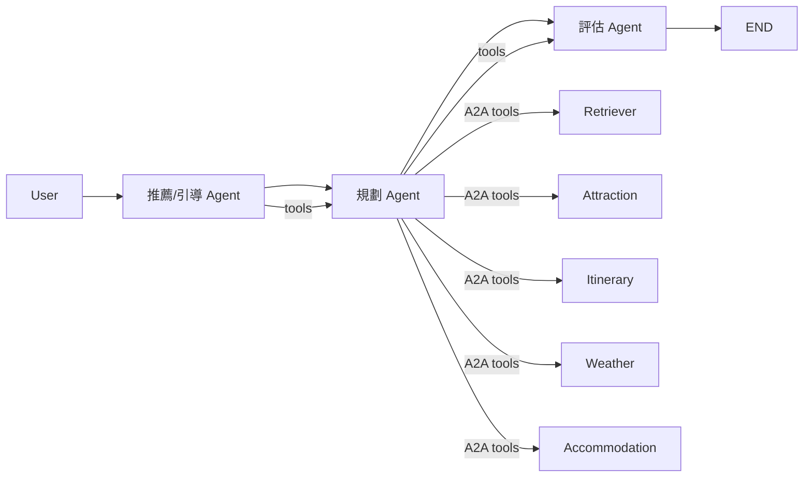
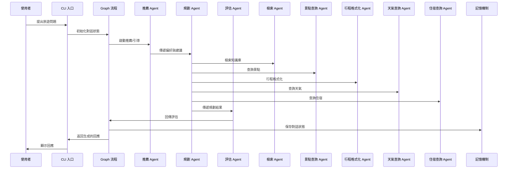

# 旅遊規劃 AI Agent — 架構總覽（第一版設計重點整合）

---

## 架構圖（Mermaid）



---

## 模組循序圖（Mermaid）



---

## 技術框架與功能特色

### 1. 框架選用

- **LangChain + LangGraph**  
  本專案核心採用 LangChain 作為 LLM 應用開發主架構，並結合 LangGraph 實現多 Agent 工作流與狀態管理。LangGraph 讓多個專業 Agent 能協作完成複雜旅遊規劃任務，支援條件分流、記憶體保存與多輪互動。

### 2. Multi-Agent 與 A2A 架構

- **多 Agent 協作（Multi-Agent）**  
  專案設計多個專業 Agent（Recommendation、Planner、Retriever、Attraction、Itinerary、Weather、Accommodation、Evaluator），各自負責推薦、規劃、檢索、查詢、評估等任務。
- **Agent-to-Agent（A2A）工具呼叫**  
  各 Agent 可透過工具（Tool）互相呼叫彼此的功能，實現跨 Agent 資訊流通與協作。例如 Planner Agent 可呼叫 Retriever Agent 檢索知識庫，再呼叫 Attraction Agent查詢景點，最後整合結果生成行程。

### 3. Function Tool 支援

- **Function Tool 機制**  
  專案大量使用 LangChain 的 Tool/StructuredTool 機制，將檢索、查詢、格式化、預算估算、路線規劃、天氣查詢、住宿查詢等功能封裝為可被 Agent 調用的 function tool。
- **自動化工具調用**  
  Agent 可根據需求自動選擇並調用合適的工具，並將結果結構化回傳，方便後續流程整合與決策。

#### 特色總結

1. **多 Agent 協作**：每個 Agent 專責不同任務，互相協作完成複雜旅遊規劃。
2. **A2A 工具呼叫**：Agent 之間可透過工具互相調用，資訊流通順暢。
3. **Function Tool 封裝**：所有核心功能皆以 Tool 形式封裝，易於擴充與維護。
4. **LangChain + LangGraph 架構**：支援多輪對話、狀態管理、條件分流與記憶體保存，提升系統彈性與可擴展性。

---

## 各節點職責說明

- **CLI**  
  負責與使用者互動，接收輸入並顯示回應。

- **Graph**  
  管理對話流程，串接各 Agent 節點，負責狀態流轉與記憶保存。

- **Recommendation Agent**  
  根據使用者偏好與歷史，給出初步建議或引導。

- **Planner Agent**  
  整合各工具與 Agent，規劃完整行程，調用檢索、景點、天氣、住宿等工具。

- **Retriever Agent**  
  從向量資料庫（Chroma）檢索與使用者 query 相關的文件，合併多輪 query 提升主題聚合度。

- **Attraction/Itinerary/Weather/Accommodation Agent**  
  各自負責景點查詢、行程格式化、天氣查詢、住宿查詢等任務。

- **Evaluator Agent**  
  評估規劃結果，給出優化建議或提醒。

- **記憶機制（MemorySaver）**  
  以 thread_id 管理 session，持久化每個對話的狀態，保證多輪對話能記住上下文。

---

## 資料流動說明

- `retrieved_docs`  
  - 在 Retriever Agent 檢索後產生，傳遞給 Planner/LLM 節點用於生成回應。

- `messages`  
  - 每輪對話都會累積，包含所有使用者與 AI 的訊息，貫穿整個流程。

- `tool_results`  
  - 各工具執行結果，結構化存入狀態，供後續節點引用。

---

## 記憶機制說明

- **Checkpointer（MemorySaver）**  
  - 以 thread_id 管理 session，持久化每個對話的狀態。
  - 保證多輪對話能記住上下文。

---

## RAG 整合說明

使用者輸入 → Recommendation/Planner 引導 → Retriever 檢索相關文件（合併多輪 query） → 各工具/Agent 查詢補充 → LLM 整合文件生成回應（聚焦主題、避免重複） → 回應累積到 messages → 持續多輪互動。

---

## 檔案結構

```
travel_agent_mvp/
├── documents/                  # 文件庫
├── chroma_db/                  # 向量資料庫
├── .env                        # 環境變數
├── prepare_documents.py        # 文件準備腳本
├── build_vectorstore.py        # 向量庫建置腳本
├── state.py                    # State Schema
├── nodes.py                    # Graph Nodes
├── graph.py                    # Graph 建構
├── main.py                     # CLI 入口
└── tests/                      # 單元測試
```

---

## 第一版設計重點

1. **知識庫內容**：準備 3-5 份結構化旅遊文件（如台北景點、東京景點、預算指南等）
2. **向量資料庫**：使用 Chroma + OpenAI Embeddings，chunk_size=500，retrieval_k=3
3. **RAG 檢索策略**：
   - 合併最近 2~3 輪 user query 做檢索，提升主題聚合度
   - 檢查本輪檢索結果是否與上一輪重複,若重複則提示「已無更多新資訊」
4. **Prompt 設計**：
   - 明確要求「優先根據文件內容回答」
   - 若無新資訊，主動告知並引導切換主題
   - 加入本輪問題重點與對話摘要
5. **LLM 整合**：
   - 格式化檢索文件，插入到 prompt
   - 支援降級處理（無文件時用通用知識回答）
6. **CLI 互動**：
   - 支援連續對話、退出命令、錯誤處理
   - 顯示角色標記、分隔線、友善提示

---

## 未來擴展規劃

- 增加工具節點（如景點搜尋 API、行程生成工具）
- 實現條件分支與人機協作
- 擴充知識庫與檢索策略
- 加入任務分解、規劃節點
- 強化多 Agent 協作與 A2A 工具串接
- 增加 function tool 類型與自動化調用能力

---